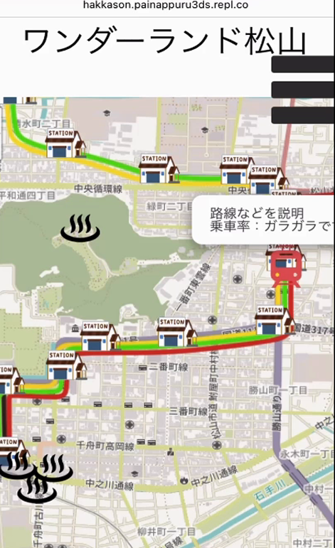
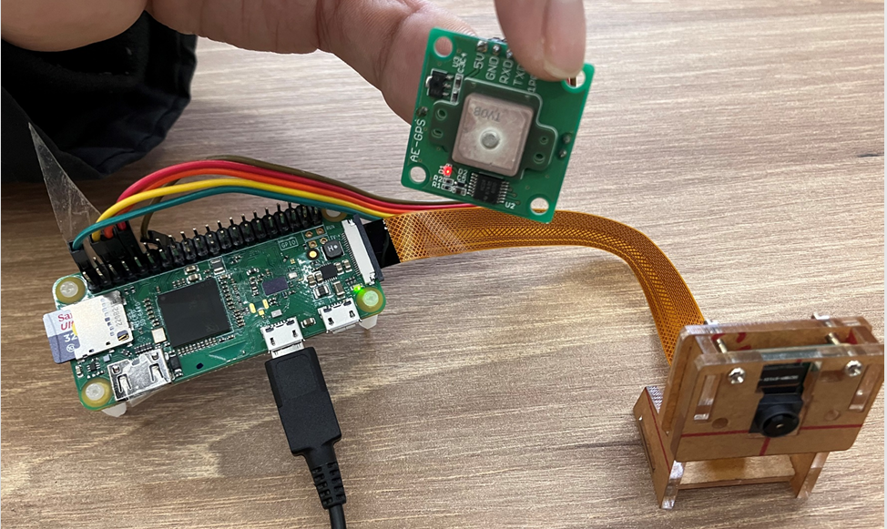
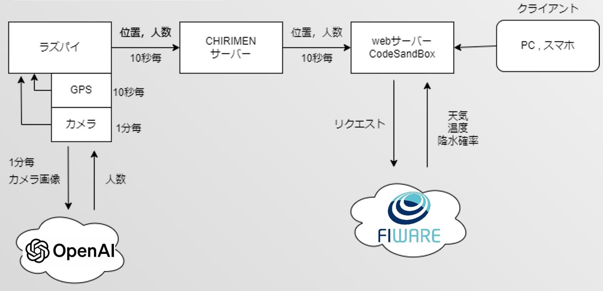

#これは何？
"Web×IoT　メーカーズチャレンジPLUS" というハッカソンイベントで作成した作品です。

##ワンダーランド松山について
###概要
松山に走る路面電車での移動を助けるための観光マップ
###課題
路面電車の運行会社である伊予鉄道が提供する路線図が見づらいと、松山市民の多数に思われている
　→初めて来る観光客ではもっと路面電車に乗りづらいのでは？
###デモ

###開発人数
5人
###役割
Node.jsを用いたマイコンへの組み込みプログラム(メイン)、フロントエンドのJS
###工夫したところ
-マイコンに取り付けたカメラから取得した画像で、openAIのAPIで電車内の混雑状況を判断できるようにした
-松山市や主催企業である愛媛CATV様が運営し推し進めている、分野横断的なデータ利活用を目的として開発されたプラットフォームのFIWAREを利用し、APIを使った天気情報の表示を行った

##ハッカソン概要
[Web×IoT　メーカーズチャレンジPLUS](https://webiotmakers.github.io/2023/)
Web×IoT メイカーズチャレンジ PLUS は、標準技術やオープンソースソフトウェア 活用についての理解を深めながら、IoT システム開発を実践的に学ぶスキルアップのためのイベントです。

前半イベントの講習会では、座学講義だけでなく、ボードコンピュータを使って Web 標準技術でセンサーやアクチュエーター (モーターなど) を制御する方法をハンズオン形式の実習で学びます。

後半イベントのハッカソンでは、講習会で学んだ技術を活かして IoT 作品をチーム毎に制作し、その成果を競います。ハッカソンまでの準備期間中、メンバーと相談して作品制作に必要な材料や事前準備を行い、ハッカソン当日にチームの IoT 作品を完成させます。また、ハッカソンの作品制作にかかる材料費も １ チームにつき最大 20,000 円まで補助があるので安心してご参加いただけます。

-【ハンズオン講習会】 2023 年 10 月 21 日 (土) - 22 日 (日)
-【ハッカソン】2023 年 12 月 16 日 (土) - 17 日 (日)
-チーム人数：5人

